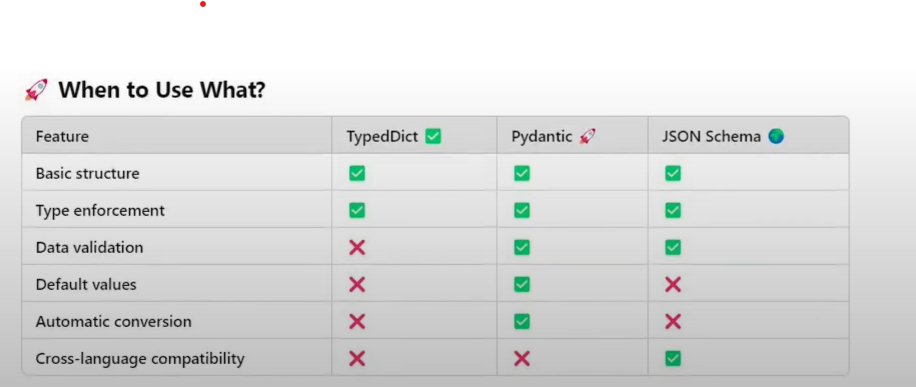

# STRUCTURED OUTPUT IN LANGCHAIN
---

## What is Structured Output?
Structured output refers to the practice of having language models return responses in a well-defined data format (like JSON), rather than free-format text. This makes model outputs easier to parse and work with programmatically.

## Why Do We Need Structured Output?
- **Data Extraction**: Consistently extract specific pieces of information
- **API Building**: Create reliable API responses with predictable schemas
- **Agents**: Enable AI agents to work with structured data for decision making
- **Integration**: Connect LLMs with databases, APIs, and other systems that require structured data

## The Challenge
LLM outputs are naturally textual (unstructured), making them difficult to integrate with databases, APIs, and other systems that require structured data.

## Ways to Get Structured Output in LangChain

### 1. Direct Structured Output (`with_structured_output`)
- **Compatible with**: Primarily OpenAI models
- **Usage**: `model.with_structured_output(schema)`
- **Implementation**: Pass a schema definition, receive structured data directly

### 2. Output Parsers
- **Compatible with**: All models including Google Gemini, Anthropic, etc.
- **Usage**: `output_parsers` function from langchain
- **Implementation**: Parse free-text output into structured format

## Schema Definition Options

### 1. TypedDict
A way to define dictionaries in Python with specified keys and value types.

**Characteristics**:
- Tells Python what keys are required and their value types
- Provides type hints for better development experience
- Does not validate data at runtime (only used for type checking)
- Simple to define and understand

**Types of TypedDict Implementation**:
- Simple TypedDict: Basic key-value type definitions
- Annotated TypedDict: Includes descriptions of fields
- TypedDict with Literals: Restricts values to predefined options
- Complex TypedDict: With nested structures for pros/cons, etc.

**Example**:
```python
class Review(TypedDict):
    summary: str
    sentiment: Literal["positive", "negative", "neutral"]
```

### 2. Pydantic Models
A comprehensive data validation and parsing library for Python.

**Characteristics**:
- Ensures data is correct, structured, and type-safe
- Validates data at runtime (unlike TypedDict)
- More verbose but offers greater control

**Features**:
- Default values: Specify fallback values
- Optional fields: Mark fields that aren't required
- Coercion: Automatically convert between compatible types
- Built-in validation: Type checking and constraints
- Field function: Set default values, constraints, descriptions, regex patterns
- Returns Pydantic objects that can be converted to JSON/dict

**Example**:
```python
class Review(BaseModel):
    summary: str = Field(description="A brief summary")
    sentiment: Literal["positive", "negative", "neutral"]
    pros: Optional[List[str]] = Field(default_factory=list)
```
### 3. JSON Schema
A declarative language for validating JSON data structures.

**Characteristics**:

- Language-agnostic schema definition
- Highly flexible and portable
- Can be more complex to write by hand

**Model Compatibility**:

-  OpenAI Models: Work well with with_structured_output, support TypedDict
- Other Models (Google Gemini, etc.): May require output parsers instead

**Best Practices**:
- Use TypedDict when working primarily with OpenAI models
- Use Pydantic for greater validation control
- Use output parsers when working with non-OpenAI models
- Consider model capabilities when designing your solution architecture



